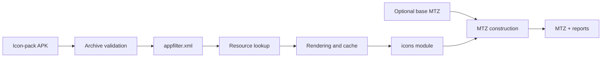

# IconPack to HyperOS MTZ

[](https://github.com/Adiker/IconPack-to-MTZ/actions/workflows/ci.yml)
[](https://github.com/Adiker/IconPack-to-MTZ/actions/workflows/security.yml)
[](LICENSE)
[](https://developer.android.com/about/versions/11)

[Polski](docs/README.pl.md) · **English**

IconPack to HyperOS MTZ is a local Android application that converts standard
Android icon-pack APKs, including Arcticons, into MIUI/HyperOS `.mtz` icon
themes.

> [!IMPORTANT]
> The archive structure is covered by automated fixtures and emulator tests.
> Import has been tested successfully on a physical POCO F8 Ultra. See the
> [compatibility notes](docs/COMPATIBILITY.md) for the current validation
> matrix and remaining limitations.

## Features

- Reads text and compiled `appfilter.xml` without installing the source APK.
- Supports VectorDrawable, adaptive icons, PNG, WebP, JPEG, and asset SVGs.
- Renders every unique source once and reuses a bounded disk LRU cache.
- Provides optimized, full-compatibility, and package-only naming strategies.
- Creates a standalone MTZ or replaces only `icons` in a working base theme.
- Produces versioned JSON and human-readable text reports.
- Runs long conversions in a cancellable foreground service.
- Stores conversion history locally with Room.
- Can optionally use Shizuku for a more complete installed-package list.
- Provides Polish and English UI.

The application declares neither `INTERNET` nor `QUERY_ALL_PACKAGES`.

## How it works



See the [architecture documentation](docs/ARCHITECTURE.md) for module
boundaries, data flow, and security constraints.

## Requirements

- Android Studio compatible with Android Gradle Plugin 9.3;
- Android SDK Platform 37 and Build Tools 37.0.0;
- a full JDK 17 or newer;
- JDK 21 for Robolectric tests that cover API 37;
- Android 11 (API 30) or newer at runtime.

## Build

```bash
git clone https://github.com/Adiker/IconPack-to-MTZ.git
cd IconPack-to-MTZ
./gradlew assembleDebug
```

For a memory-conservative full validation, run each task separately:

```bash
./gradlew --no-daemon --max-workers=1 test
./gradlew --no-daemon --max-workers=1 lint
./gradlew --no-daemon --max-workers=1 assembleDebug
./gradlew --no-daemon --max-workers=1 bundleRelease
```

Managed-device smoke tests:

```bash
./gradlew --no-daemon --max-workers=1 pixel2Api30DebugAndroidTest
./gradlew --no-daemon --max-workers=1 pixel2Api37DebugAndroidTest
```

`bundleRelease` creates an unsigned AAB. Signing credentials are deliberately
not stored in the repository.

## Usage

1. Select an icon-pack APK through Android's document picker.
2. Optionally select a known-working base MTZ.
3. Choose an output directory, conversion mode, and naming strategy.
4. Analyze the APK. Up to 64 representative icons are rendered into the cache
   to estimate output size.
5. Start generation. The foreground service keeps working outside the UI and
   exposes cancellation.

Full mode always converts the entire appfilter and needs neither root nor
Shizuku. Enabling Shizuku after its service has started requests permission and
the app refreshes its state when permission is granted or Shizuku restarts.
Installed-apps mode is an optional optimization and can be incomplete
because of Android package-visibility filtering.

## Output format

Standalone MTZ output:

```text
description.xml
icons
preview/preview_icons_0.jpg
```

`icons` is an extensionless inner ZIP:

```text
res/drawable-xxhdpi/com.example.app.png
res/drawable-xxhdpi/com.example.app.MainActivity.png
```

In base-theme mode, original entries are preserved except for the exact root
`icons` entry, which is replaced.

## Security and privacy

APK and MTZ inputs are untrusted. The pipeline enforces limits for archive
entries, expanded bytes, compression ratio, XML depth, source bitmap size, and
output aliases. It blocks external XML entities, Zip Slip, path traversal, and
unsafe output names.

All processing is local. Operational copies live only in the application's
private cache and are removed after completion or cancellation. Exported
reports redact private paths and URI values.

Please report suspected vulnerabilities according to
[SECURITY.md](SECURITY.md), not in a public issue.

## Validation status

| Check | Result |
| --- | --- |
| JVM/Robolectric tests | 34 tests, API 30 and 37, passed |
| Android Lint | 0 errors |
| Debug APK | Built |
| Release AAB | Built, unsigned |
| Emulator API 30 | Instrumented test passed |
| Emulator API 37 | Instrumented test passed |
| Physical POCO F8 Ultra | MTZ import tested successfully |

The fixture APK contains only original CC0 geometric assets. The repository
does not contain Arcticons or other third-party icon packs.

## Repository structure

| Module | Responsibility |
| --- | --- |
| `app` | Compose UI, SAF, Hilt, and foreground service |
| `core-model` | Contracts, models, limits, and naming planning |
| `core-archive` | ZIP validation, safe paths, and hashing |
| `core-apk` | appfilter, ARSCLib, and isolated Android resources |
| `core-renderer` | Drawable, SVG, and cached rendering |
| `core-mtz` | Metadata, preview, `icons`, and outer MTZ |
| `core-report` | Versioned JSON/TXT reports |
| `core-data` | Room history |
| `feature-converter` | Concurrent, cancellable pipeline |
| `feature-settings` | DataStore settings |
| `feature-history` | History feature boundary |
| `integration-shizuku` | Optional read-only integration |
| `fixture-iconpack` | Synthetic CC0 fixture APK |

## Contributing

See [CONTRIBUTING.md](CONTRIBUTING.md). Changes should include appropriate
tests, must not add material from third-party icon packs, and should preserve
the fully local processing model.

## Documentation

- [Architecture](docs/ARCHITECTURE.md)
- [Compatibility and limitations](docs/COMPATIBILITY.md)
- [Contributing](CONTRIBUTING.md)
- [Third-party notices](THIRD_PARTY_NOTICES.md)

## License

Project code is licensed under the [Apache License 2.0](LICENSE). The
repository contains no third-party icon packs. Users remain responsible for
the rights required to convert, use, or redistribute icons from a selected
APK.
