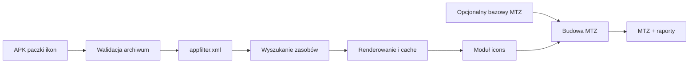

# IconPack to HyperOS MTZ

[](https://github.com/Adiker/IconPack-to-MTZ/actions/workflows/ci.yml)
[](https://github.com/Adiker/IconPack-to-MTZ/actions/workflows/security.yml)
[](LICENSE)
[](https://developer.android.com/about/versions/11)

**Polski** · [English](docs/README.en.md)

Lokalna aplikacja Android konwertująca paczki ikon APK — w tym Arcticons — do
modułu ikon motywu MIUI/HyperOS w pliku `.mtz`.

> [!IMPORTANT]
> Projekt waliduje strukturę MTZ na fixture i emulatorach, ale import w
> aplikacji Motywy Xiaomi lub zFont na fizycznym urządzeniu HyperOS nie został
> jeszcze potwierdzony. Szczegóły zawiera
> [macierz zgodności](docs/COMPATIBILITY.md).

## Najważniejsze możliwości

- analizowanie APK bez instalowania i bez wysyłania danych do sieci;
- tekstowe i skompilowane `appfilter.xml`;
- VectorDrawable, adaptive icons, PNG, WebP, JPEG i SVG;
- trzy strategie nazw: zoptymalizowana, pełna i tylko pakietowa;
- renderowanie każdego unikalnego zasobu raz oraz dyskowy cache LRU;
- samodzielny MTZ albo zachowanie bazowego motywu z podmianą tylko `icons`;
- raport JSON i tekstowy po sukcesie, błędzie lub anulowaniu;
- lokalna historia konwersji w Room;
- opcjonalne Shizuku wyłącznie do odczytu pełniejszej listy pakietów;
- polski i angielski interfejs.

Aplikacja nie deklaruje uprawnień `INTERNET` ani `QUERY_ALL_PACKAGES`.

## Jak działa



Pełny opis granic modułów, przepływu danych i zabezpieczeń znajduje się w
[dokumentacji architektury](docs/ARCHITECTURE.md).

## Wymagania

- Android Studio zgodne z Android Gradle Plugin 9.3;
- Android SDK Platform 37 i Build Tools 37.0.0;
- pełny JDK 17 lub nowszy;
- JDK 21 do testów Robolectric obejmujących API 37;
- urządzenie z Androidem 11 (API 30) lub nowszym.

Projekt używa `compileSdk/targetSdk 37` oraz `minSdk 30`.

## Budowanie

```bash
git clone https://github.com/Adiker/IconPack-to-MTZ.git
cd IconPack-to-MTZ
./gradlew assembleDebug
```

Debug APK powstaje w:

```text
app/build/outputs/apk/debug/app-debug.apk
```

Pełna lokalna walidacja:

```bash
./gradlew --no-daemon --max-workers=1 test
./gradlew --no-daemon --max-workers=1 lint
./gradlew --no-daemon --max-workers=1 assembleDebug
./gradlew --no-daemon --max-workers=1 bundleRelease
```

Projekt domyślnie ogranicza Gradle do dwóch workerów i wyłącza równoległe
wykonywanie. Uruchamianie ciężkich zadań osobno dodatkowo zmniejsza szczytowe
zużycie RAM-u.

Testy zarządzanych emulatorów:

```bash
./gradlew --no-daemon --max-workers=1 pixel2Api30DebugAndroidTest
./gradlew --no-daemon --max-workers=1 pixel2Api37DebugAndroidTest
```

Gradle pobierze obrazy `google_apis;x86_64`, jeżeli nie są zainstalowane.
Emulatory wymagają sprzętowej wirtualizacji do rozsądnej wydajności.

`bundleRelease` tworzy niesygnowany AAB. Repozytorium celowo nie zawiera klucza
ani haseł; przed dystrybucją należy podpisać bundle własnym kluczem w Android
Studio albo użyć bezpiecznego magazynu poświadczeń CI.

## Użycie

1. Wybierz APK paczki ikon przez systemowy selektor dokumentów.
2. Opcjonalnie wskaż działający bazowy `.mtz`.
3. Wybierz katalog docelowy, tryb konwersji i strategię nazw.
4. Uruchom analizę. Maksymalnie 64 reprezentatywne ikony zostaną wyrenderowane
   do cache, aby oszacować rozmiar wyniku.
5. Uruchom generowanie. Foreground Service kontynuuje pracę po opuszczeniu UI
   i pozwala anulować operację.

Tryb pełny zawsze przetwarza całe `appfilter.xml`. Tryb „tylko zainstalowane”
korzysta najpierw z aktywności widocznych dla `PackageManager`; wynik może być
niepełny z powodu ograniczeń widoczności pakietów Androida. Shizuku jest
opcjonalnym, świadomie włączanym rozszerzeniem.

## Format wyniku

Samodzielny MTZ:

```text
description.xml
icons
preview/preview_icons_0.jpg
```

`icons` jest wewnętrznym ZIP-em bez rozszerzenia:

```text
res/drawable-xxhdpi/com.example.app.png
res/drawable-xxhdpi/com.example.app.MainActivity.png
```

W wariancie bazowym oryginalne wpisy są zachowywane, z wyjątkiem dokładnego
głównego wpisu `icons`, który zostaje zastąpiony.

## Bezpieczeństwo i prywatność

APK i MTZ są traktowane jako niezaufane archiwa. Pipeline ogranicza liczbę i
rozmiar wpisów, współczynnik kompresji, rozmiary XML i bitmap oraz liczbę
plików wynikowych. Parsery blokują DOCTYPE i encje zewnętrzne, a nazwy plików
są chronione przed Zip Slip i path traversal.

Pliki robocze pozostają w prywatnym cache aplikacji i są usuwane po zakończeniu
lub anulowaniu. Historia nie przechowuje kopii APK. Eksportowane raporty nie
zawierają pełnych prywatnych URI ani ścieżek.

Podejrzenie podatności należy zgłosić zgodnie z
[polityką bezpieczeństwa](SECURITY.md), nie w publicznym issue.

## Stan walidacji

| Sprawdzenie | Wynik |
| --- | --- |
| Testy JVM/Robolectric | 34 testy, API 30 i 37, bez błędów |
| Android Lint | 0 błędów |
| Debug APK | zbudowany |
| Release AAB | zbudowany, niesygnowany |
| Emulator API 30 | test platformowy zaliczony |
| Emulator API 37 | test platformowy zaliczony |
| Fizyczne Xiaomi/HyperOS | jeszcze niezweryfikowane |

Fixture APK zawiera wyłącznie autorskie geometryczne zasoby CC0. Repozytorium
nie zawiera ikon Arcticons ani innych zewnętrznych paczek.

## Struktura repozytorium

| Moduł | Odpowiedzialność |
| --- | --- |
| `app` | Compose UI, SAF, Hilt i Foreground Service |
| `core-model` | kontrakty, modele, limity i planowanie nazw |
| `core-archive` | walidacja ZIP, bezpieczne ścieżki i hashing |
| `core-apk` | appfilter, ARSCLib i izolowane Android Resources |
| `core-renderer` | renderowanie drawable, SVG i cache |
| `core-mtz` | metadata, preview, moduł `icons` i zewnętrzny MTZ |
| `core-report` | wersjonowane raporty JSON/TXT |
| `core-data` | historia Room |
| `feature-converter` | współbieżny i anulowalny pipeline |
| `feature-settings` | ustawienia DataStore |
| `feature-history` | granica funkcji historii |
| `integration-shizuku` | opcjonalna integracja tylko do odczytu |
| `fixture-iconpack` | syntetyczny fixture APK CC0 |

## Współpraca

Zobacz [CONTRIBUTING.md](CONTRIBUTING.md). Zmiany powinny mieć testy
odpowiednie do zakresu, nie mogą dodawać materiałów z cudzych paczek ikon i
powinny zachować całkowicie lokalny model przetwarzania.

## Licencja

Kod projektu jest dostępny na licencji
[Apache License 2.0](LICENSE). Główne zależności opisuje
[THIRD_PARTY_NOTICES.md](THIRD_PARTY_NOTICES.md).

Licencja aplikacji nie nadaje praw do ikon z wybranego APK. Użytkownik
odpowiada za posiadanie prawa do konwersji, użycia i dystrybucji paczki ikon
oraz wynikowego motywu.
