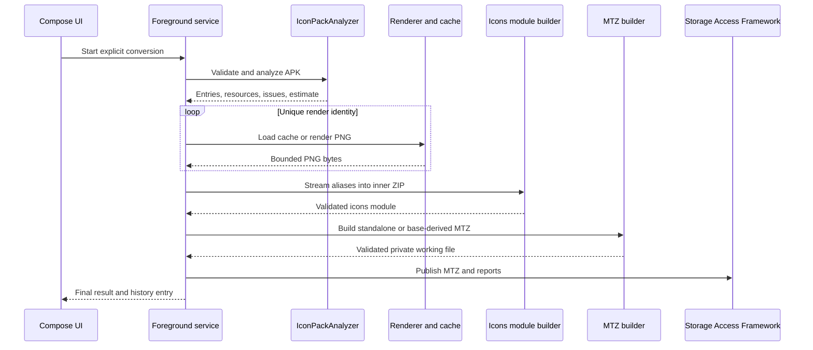

# Architecture

## Goals

The project separates untrusted archive handling, Android resource loading,
rendering, MTZ construction, persistence, and UI orchestration. Core modules
expose small contracts so that parsing and naming behavior can be tested
without starting the application.

The main integration points are:

- `IconPackAnalyzer`
- `ConversionEngine`
- `InstalledAppsProvider`
- `RenderCache`
- `MtzBuilder`
- `ReportWriter`
- `ConversionReportV1`

## Module boundaries

| Module | Responsibility |
| --- | --- |
| `app` | Compose screens, Hilt graph, SAF integration and foreground service |
| `core-model` | Stable contracts, models, limits, component normalization and naming plans |
| `core-archive` | Archive validation, bounded reads, hashing and safe entry names |
| `core-apk` | Mapping discovery, appfilter parsing, ARSCLib and isolated Android resources |
| `core-renderer` | Native drawable rendering, SVG handling and disk LRU cache |
| `core-mtz` | Theme metadata, preview generation and deterministic ZIP construction |
| `core-report` | Versioned JSON and text reports with sensitive-value redaction |
| `core-data` | Room entities and history repository |
| `feature-converter` | Cancellation-aware conversion pipeline and progress events |
| `feature-settings` | DataStore-backed user and advanced settings |
| `feature-history` | History feature boundary |
| `integration-shizuku` | Optional read-only installed-package provider |
| `fixture-iconpack` | CC0 fixture APKs with text and compiled resources |

Dependencies point from Android-facing modules toward stable core contracts.
The Shizuku module is optional and is not required by full conversion mode.

## Conversion flow

The destination document is created only after the private working result has
been built and validated. A failed or cancelled operation removes incomplete
output documents where the provider permits deletion.

## APK analysis

The analyzer searches common CandyBar and icon-pack locations, beginning with
`assets/appfilter.xml`, then resource XML/raw candidates and common fallback
names. Compiled mappings are opened through isolated `Resources` loaded from
the selected APK.

The streaming parser:

- rejects DOCTYPE and external entities;
- limits XML bytes, depth, and mapping count;
- expands relative and short activity names;
- records malformed components and duplicate conflicts;
- lets the final valid duplicate component mapping win.

Resource selection prefers asset SVGs and vector/adaptive resources, followed
by the best available raster dimensions and density. Source resources are
identified by SHA-256 whenever their raw representation is available.

## Naming and deduplication

The optimized naming strategy groups mappings by package:

- one drawable for the package produces only `package.name.png`;
- several drawables assign the most frequent drawable to the package name;
- activities with a different drawable receive a full activity alias.

Ties use first appearance order. Full-compatibility mode emits an activity
alias for every mapping, while package-only mode emits only the dominant
package icon.

A shared cache key hashes the source identity, renderer version, output size,
and margin. A drawable is rendered once per configuration. Identical content
across differently named drawables shares cached PNG data, while aliases only
stream those bytes again into the icons archive.

## Background execution

Conversion starts from an explicit user action in a `dataSync` foreground
service. Progress is published as a Flow and includes the current stage,
rendered count, alias count, cache statistics, and errors. Cancellation is
cooperative across parsing, rendering, and archive construction.

Worker concurrency is bounded to 1–4, with a default based on CPU count but
never above four. Expensive work stays off the main thread.

## Trust boundaries

APK and MTZ files are hostile inputs. Default protections include:

- canonical archive-entry validation and Zip Slip rejection;
- entry-count, compressed-byte, expanded-byte, per-entry, and ratio limits;
- bounded XML depth, text size, and reference recursion;
- bitmap dimension and pixel-count checks before full decoding;
- normalized output names without separators, controls, or traversal;
- configurable advanced limits capped by hard maximums;
- private, operation-scoped working directories;
- exported-report redaction for private paths and URI values.

The application has no network permission. Shizuku integration performs only
package-list reads after explicit opt-in.

## Testing strategy

Pure JVM tests cover component normalization, package grouping, naming
strategies, deduplication, archive limits, metadata, reports, and deterministic
ZIP output. Robolectric covers isolated APK resources and rendering on API 30
and 37. End-to-end tests build and reopen standalone and base-derived MTZ
fixtures.

Managed-device smoke tests run on x86_64 API 30 and API 37 images. Physical
Xiaomi testing remains a separate compatibility requirement.
